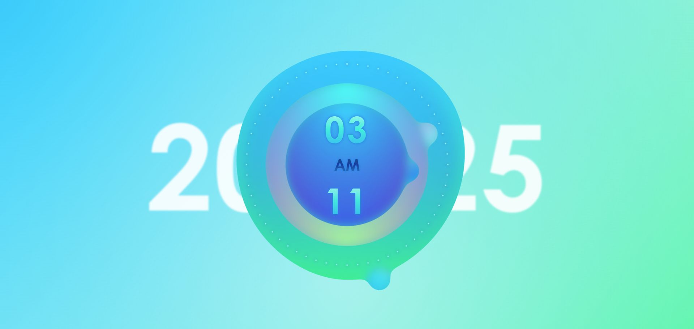

# ⏰ Liquid Clock — JS 動態時鐘實作

> _「時間，是一場不斷流動的光之舞。」_

這是一個使用 **JavaScript 原生語法與 CSS** 製作的液態風格時鐘作品，誕生於我學習 `setInterval` 的階段。從指針的每一次旋轉，到漸層背景與模糊光暈，這不只是時鐘，更是一場與時間共舞的視覺演出。

[🔗 Live Demo](http://homershie.com/flowing_clock/)

---

## 🛠 技術亮點

### JavaScript 動態邏輯

- 使用 `setInterval()` 每毫秒更新畫面，驅動秒針、分針、時針旋轉
- 時間格式轉換（12 小時制 AM/PM）
- 點擊中心區塊可顯示／隱藏數位時間

### CSS 視覺設計

- `radial-gradient` 創造夢幻空間感
- `filter: drop-shadow()`、`blur`、`gooey` 濾鏡營造液態手感
- 使用 `transform-origin` 實作指針旋轉中心

### KUTE.js SVG 動畫

- 引入 [KUTE.js](https://thednp.github.io/kute.js/) 動態補間動畫
- 三段漸變 blob 路徑交替變形，創造秒針動畫的生命感

---

## 📸 預覽畫面

---

## 📚 學習收穫

- 熟悉 `Date` 物件與時間邏輯運算
- 強化 JavaScript 與 CSS 動畫整合技巧
- 初步實踐 SVG 與動畫庫的搭配應用

---

## 🪐 特別感謝

- KUTE.js — SVG Path Morphing 支援
- 時間本人 — 無聲流動，卻讓我們學會創造節奏
